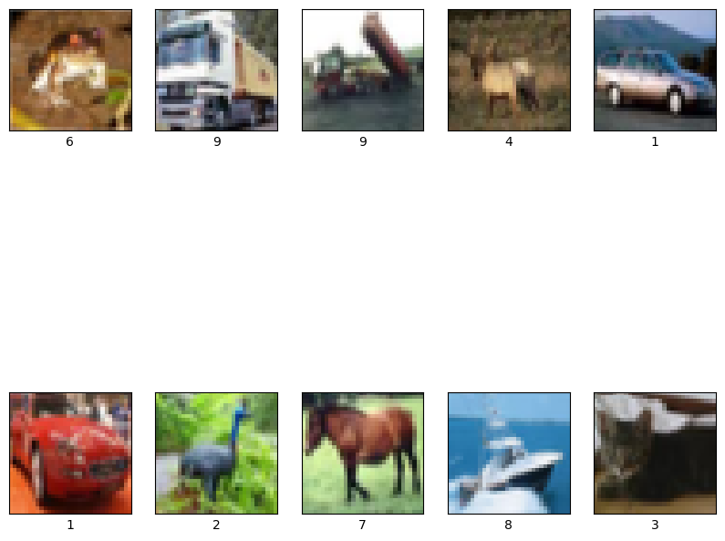

# CIFAR-10 Veri Seti Üzerinde Model Performansı Değerlendirmesi 📊

Bu notebook'ta CIFAR-10 veri seti üzerinde farklı makine öğrenimi modellerinin performansını değerlendirdim. CIFAR-10, 10 farklı sınıfa ait renkli görüntüler içeren bir veri setidir.

---

## Adım 1: Veri Seti Yükleme ve Görselleştirme 🖼️

Eğitim veri seti boyutu: (50000, 32, 32, 3)  
Test veri seti boyutu: (10000, 32, 32, 3)

---

## Adım 2: Veri Ön İşleme: Normalize Etme 📏

Düzleştirilmiş Eğitim veri seti boyutu: (50000, 3072)  
Düzleştirilmiş Test veri seti boyutu: (10000, 3072)

---

## Adım 3: Model Performansı 🚀

Farklı makine öğrenimi modelleri kullanarak eğitim yapıp performanslarını değerlendirdik. İşte elde ettiğimiz sonuçlar:

| Model                 | Doğruluk | F1 Skoru | Recall  | Precision |
|-----------------------|----------|----------|---------|-----------|
| KNN                   | 0.3303   | 0.3192   | 0.3303  | 0.4304    |
| Random Forest         | 0.4654   | 0.4621   | 0.4654  | 0.4610    |
| Decision Tree         | 0.3055   | 0.3027   | 0.3055  | 0.3053    |
| Logistic Regression   | 0.3859   | 0.3839   | 0.3859  | 0.3831    |

---

## Özet Açıklama

Bu çalışmada çeşitli makine öğrenmesi modellerinin performanslarını CIFAR-10 veri seti üzerinde karşılaştırdık. Random Forest modeli en yüksek doğruluğu ve F1 puanını elde etti.

- Colab Link:   https://colab.research.google.com/drive/1tGdKwyMa9kR7gAjATYmM6dl66aYsAlBB?usp=sharing

## The English description is below.

In this notebook, I evaluated the performance of various machine learning models on the CIFAR-10 dataset, which consists of colored images belonging to 10 different classes.

---

### Step 1: Data Loading and Visualization 🖼️

Firstly, we loaded the CIFAR-10 dataset and checked the dimensions of the training set:

- **Training set size:** (50000, 32, 32, 3)
- **Test set size:** (10000, 32, 32, 3)

---

### Step 2: Data Preprocessing: Normalization 📏

We flattened and normalized the data:

- **Flattened training data size:** (50000, 3072)
- **Flattened test data size:** (10000, 3072)

---

### Step 3: Model Performance 🚀

We trained different machine learning models and evaluated their performances. Here are the results we obtained:

| Model                 | Accuracy | F1 Score | Recall  | Precision |
|-----------------------|----------|----------|---------|-----------|
| KNN                   | 0.3303   | 0.3192   | 0.3303  | 0.4304    |
| Random Forest         | 0.4654   | 0.4621   | 0.4654  | 0.4610    |
| Decision Tree         | 0.3055   | 0.3027   | 0.3055  | 0.3053    |
| Logistic Regression   | 0.3859   | 0.3839   | 0.3859  | 0.3831    |

---

We calculated Accuracy, F1 Score, Recall, and Precision metrics for each model and compared their performances.

In conclusion, the Random Forest model achieved the highest Accuracy and F1 Score on the CIFAR-10 dataset. We thoroughly examined and compared the performances of the other models as well.

## Summary

In this study, we compared the performances of various machine learning models on the CIFAR-10 dataset. The **Random Forest model** achieved the highest accuracy and F1 score.

